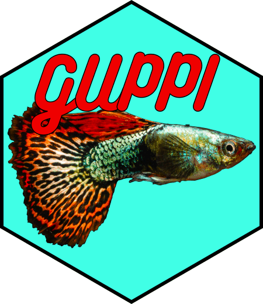

Get UniProt Protein Info (GUPPI)
================



Process [TDPortal](http://nrtdp.northwestern.edu/tdportal-request/) and
[ProSightPD](http://proteinaceous.net/product/prosightpd/) top-down
reports (.tdReport files) by retrieving information from
[UniProt](http://www.uniprot.org/) and filtering by false detection
rate. [TDViewer](http://topdownviewer.northwestern.edu/) is also highly
recommended for viewing top-down reports.

The easiest way to use the functionality of GUPPI by accessing the
[GUPPI web application](https://icr1.magnet.fsu.edu).

## Installation

Install from Github with:

``` r
remotes::install_github("davidsbutcher/GUPPI")
```

## Running with Docker

A pre-built Docker image is available at [Docker
hub](https://hub.docker.com/repository/docker/davidsbutcher/guppi/tags?page=1).
Alternately, after downloading the source code the Dockerfile found in
`/inst/shiny` can be used to build the Docker image.

### Docker on Windows and macOS

To download the image and start a container, install [Docker
Desktop](https://www.docker.com/products/docker-desktop), start it, and
run the following commands in the appropriate shell (e.g. Windows
PowerShell). NOTE: Check [Docker
hub](https://hub.docker.com/repository/docker/davidsbutcher/guppi/tags?page=1)
for the latest release version before pulling an image.

``` powershell

docker pull davidsbutcher/guppi:release6

docker run -p 3838:3838 davidsbutcher/guppi:release6
```

The application can be accessed in a web browser at
<http://localhost:3838> after the Docker container is started.

## Input

The processing of tdReports is carried out by the `guppi()` function. An
example of running the function:

``` r
library(GUPPI)

guppi(
   "C:/Users/David Butcher/TDReports",
   c(
      "20200420_Excellent_TDReport_01.tdReport",
      "20200420_Excellent_TDReport_02.tdReport"
   ),
   83333,
   GOLocType = "bacteria",
   fractionAssignments = NULL,
   outputdir = "C:/Users/David Butcher/guppi_output",
   fdr = 0.01,
   saveOutput = TRUE,
   makeDashboard = TRUE
)
```

Arguments to the `guppi` function are as follows:

### Mandatory arguments

  - `filedir` Add the path to the folder containing tdReports to be
    processed. This directory can be at any level above the tdReports in
    the directory structure.

  - `filename` Full name of the tdReport file or files, including
    extension. Must match the name of file exactly.

  - `taxonNumber` NCBI taxon number to use for adding UniProt data.
    Should match the taxon number from the TDPortal/ProSightPD analysis.

  - `outputdir` Directory to place output files. Directory will be
    created if it doesn’t exist, but parent directory must be an
    existing folder.

### Optional arguments

  - `GOLocType` Name of taxon to use for determination of subcellular
    locations. Acceptable values are “bacteria” or “eukaryota”.

  - `fractionAssignments` Optional argument. A named list with names set
    to the fraction numbers of the input files and values set to the
    input file names. If left blank, GUPPI will attempt to assign
    fraction numbers automatically from file names in the tdReport.

  - `fdr` False detection rate to use for filtering results. Defaults to
    1%.

  - `saveOutput` Boolean value. Controls whether protein report,
    proteoform report, etc. are saved to output directory. Doesn’t
    effect GUPPI report. Defaults to TRUE.

  - `makeDashboard` Boolean value (TRUE or FALSE) which controls whether
    an HTML report is generated. Defaults to FALSE.

  - `dashboardPath` Full path and name of dashboard output (i.e. GUPPI
    report). Defaults to saving to the /report subdirectory of the
    output directory.

## Analysis of tdReports

A connection is established to the SQLite database in the TD Report
using `RSQLite`. All protein- and proteoform-level IDs and other
relevant data for each ID are extracted. The taxon number is checked
against files in the package directory to see if a corresponding UniProt
taxon database has already been downloaded. The following UniProt
databases are included with the package: **Escherichia coli**,
**Saccharomyces cerevisiae**, **Chlamydomonas reinhardtii**,
**Mycoplasma genitalium**, **Caenorhabditis elegans**, **Homo sapiens**,
and **Mus musculus**.

If a database is not available, the UniProt web service is queried for
all UniProt accession numbers in the taxon using the package
`UniProt.ws`. Protein name, organism, organism taxon ID, protein
sequence, protein function, subcellular location, and any associated GO
IDs are returned. Note that some of these values may not be found and
come back as empty or NA. This process can take a long time, owing to
limitations with the UniProt web service.

The UniProt taxon database is used to add information for all IDs
extracted from the tdReport. GO terms are obtained for all GO IDs using
the `GO.db` package and terms corresponding to subcellular locations are
saved in column “GO\_subcellular\_locations”.

Minimum Q value from among all hits, average and monoisotopic masses,
and data file for lowest Q value hit are obtained for all proteoforms.
Proteoforms whose Q values are above the FDR cutoff are deleted.
Proteoforms whose corresponding protein entry is above the FDR cutoff
are also deleted.

## Output

The “main” output includes Q values, observed precursor masses, data
files, subcellular locations from the GO database and a variety of other
parameters for all protein and proteoform IDs. All protein and
proteoform IDs with Q values which are missing or greater than the
cutoff value (`fdr`) are deleted.

Output files are saved to the output directory (`outputdir`). Files are
timestamped with the time the script was initialized or share the same
name as the input file.

  - Protein results are saved to
    `outputdir/protein_results/YYYYMMDD_hhmmss_protein_results.xlsx`.
  - Proteoform results are saved to
    `outputdir/proteoform_results/YYYYMMDD_hhmmss_proteoform_results.xlsx`.
  - Output xlsx files contain sheets corresponding to each input
    tdReport file and a final summary sheet containing all input file
    names and counts of proteins based on identified subcellular
    localizations.
  - Proteoform results including all hits from the tdReport are saved to
    `outputdir/protein_results_allhits/{filename}_allhits.xlsx`.
  - Results showing generalized subcellular localizations determined
    from protein results for each tdReport are saved to
    `outputdir/protein_results_countsbyfraction/YYYYMMDD_hhmmss_countsbyfrac.xlsx`.
  - If `makeDashboard` is set to TRUE, an HTML report is saved to
    `outputdir/report`.

## Dependencies

Package dependencies are listed in the `Imports` section of the
DESCRIPTION file and include packages from CRAN, Bioconductor, and
Github.

## License and attribution

Package developed by David S. Butcher and available under the [MIT
license](https://opensource.org/licenses/MIT).
